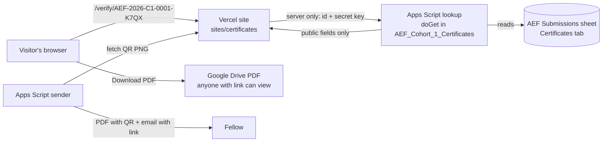

# ✨ feat: Certificate verification website

## In plain words

We are building a public website where anyone types a certificate number and
instantly sees whether it is a real Behind the Data Academy certificate, with the
fellow's name, programme and a picture of the certificate, plus a PDF download.

It is built in four stages:

1. **Get the Google Sheet ready.** The certificate numbers get a short random code
   so they can't be guessed. The existing certificate automation learns to answer one
   question from the website: "is this certificate number real?" It replies with public
   details only, never emails.
2. **Build the website** on Vercel at a free address (planned: `btd-certificates.vercel.app`).
   We design the screens on the design canvas first and you approve them.
3. **Connect the two.** Every certificate PDF gets a QR code and a "verify online" line,
   and every certificate email gets a link to the fellow's page.
4. **Launch.** You run a test, check it, then send the real Cohort 1 certificates.

Nothing is emailed to fellows until stage 4.

## Overview

A Next.js site on Vercel (`sites/certificates/`) that looks up a certificate ID through
a secret-protected lookup endpoint added to the existing `AEF_Cohort_1_Certificates`
Apps Script project (brainstorm decision: approach A). Only rows with
`Certificate Status = Sent` verify. The site shows the details, an HTML rendering of the
certificate and a Drive download link, plus QR, LinkedIn and copy-link extras.

## Decisions carried in (from the brainstorm and follow-up)

- Lookup is **by certificate ID only**. There is no search by name or email.
- Only **Sent** certificates verify. Deleting a row or changing its status stops it verifying.
- Result page: Verified badge, name, programme, cohort, award, issue date, the certificate picture and a PDF download.
- Built for **all programmes and cohorts**. The ID prefix says which one.
- Free **Vercel address** for now. It keeps working if a custom domain is added later.
- **New (2026-09-18): IDs get a random 4-character code**, for example `AEF-2026-C1-0001-K7QX`,
  so nobody can list every fellow by counting through the numbers.
- **Hold sending Cohort 1 certificates until the site is live** (the QR code and email link need its address).

## Research findings

- **The GitHub repo is public**, so no secret or signature may be committed. The lookup key
  lives only in Apps Script Script Properties and in Vercel environment variables.
  `assets/signatures/` is already git-ignored.
- **The web certificate picture omits the handwritten signature.** The signature image is private,
  and serving it from a public repo or site would defeat that. The web picture prints
  "Ayoade Adegbite, Founder" as text, and the downloadable PDF keeps the real signature.
  *(Tell us if you want the signature shown on the website too; that needs a private
  image store and is out of scope for now.)*
- Existing patterns to follow:
  - Apps Script structure, sidebar buttons and tests: `projects/AEF_Cohort_1_Certificates/src/Code.js`,
    `projects/AEF_Cohort_1_Certificates/tests/certificates.test.js` (node:test + vm).
  - Deploying through clasp: `scripts/clasp-project.ps1`. clasp is logged in as `behindthedata8@gmail.com`.
  - Vercel CLI 58 is installed and logged in (`hello-34777887`).
- Next.js 16 App Router: dynamic route `params` is a Promise (`const { id } = await params`), and
  `fetch(url, { next: { revalidate: N } })` gives time-based caching. `notFound()` renders a real 404.
- An Apps Script web app's `/exec` URL answers with a redirect to `script.googleusercontent.com`,
  which server-side `fetch` follows automatically. `doGet` can read URL parameters but not headers,
  so the key is sent as a parameter from the server only, never from the browser.
- There is no `docs/solutions/` folder yet, so there are no recorded past lessons to apply.

## Technical approach

### How the pieces talk



### Lookup reply (the only data that leaves the sheet)

```json
{ "ok": true, "found": true, "certificate": {
  "id": "AEF-2026-C1-0001-K7QX",
  "name": "Ada Lovelace",
  "programme": "Analytics Engineering Fellowship",
  "cohort": "2026 · Cohort 1",
  "award": "Certificate of Participation",
  "issued": "September 2026",
  "pdfUrl": "https://drive.google.com/uc?export=download&id=<fileId>"
} }
```

The other replies are `{ "ok": true, "found": false }` and `{ "ok": false, "error": "unauthorized" }`.
Email, approval state, errors and send times are **never** included.

### Implementation phases

#### Phase 1: Get the sheet and the automation ready (Apps Script)

Files: `projects/AEF_Cohort_1_Certificates/src/Code.js`, `src/Lookup.js` (new),
`src/appsscript.json`, `tests/certificates.test.js`, `tests/lookup.test.js` (new), `README.md`.

- [ ] **Random code in IDs.** `formatCertificateId_` appends `-XXXX` from an alphabet without
      look-alike characters (`ABCDEFGHJKMNPQRSTUVWXYZ23456789`), generated from `Utilities.getUuid()`.
      `certificateNumber_` still reads the running number, so numbering stays in order.
- [ ] **Backfill.** "Build / Refresh Certificate List" adds a code to any existing row whose ID has
      none **and** is not yet Sent. Sent IDs are never changed.
- [ ] **Programme labels in config.** Add `programme`, `cohortLabel`, `award` and `issuedLabel`
      to `AEF_CERT_CONFIG` (these match the printed certificate), plus `siteUrl`.
- [ ] **Lookup endpoint.** `doGet(e)` in `Lookup.js`:
  - Rejects a missing or wrong `key` (compared with the Script Property `AEF_CERT_LOOKUP_KEY`).
  - Normalises the ID: trims it, makes it upper case and removes spaces.
  - Reads the Certificates tab through a stored `AEF_CERT_SPREADSHEET_ID` (saved by Setup), so it
    works outside the open spreadsheet.
  - Returns only the public fields above, and only for `Sent` rows with a PDF link.
  - The pure function `buildLookupReply_(rows, id)` is unit-tested.
- [ ] **Sidebar button "Create Website Lookup Key".** It makes a random key, saves it in Script
      Properties and shows it once so it can be pasted into Vercel.
- [ ] **PDF sharing.** When a PDF is created (or reused), set it to "anyone with the link can view"
      (`file.setSharing(DriveApp.Access.ANYONE_WITH_LINK, DriveApp.Permission.VIEW)`).
- [ ] **Web app settings** in `appsscript.json`:
      `"webapp": { "executeAs": "USER_DEPLOYING", "access": "ANYONE_ANONYMOUS" }`.
- [ ] Deploy with clasp and record the deployment ID in the project README, so later updates keep
      the same web address. The first deployment may need one "Authorise" click from you in Apps Script.
- [ ] Tests:
  - IDs have the code format.
  - Backfill skips Sent rows.
  - Lookup: wrong key is refused, unknown ID is not found, a non-Sent row is not found, a Sent row
    returns public fields only (the test asserts the email is absent), and lowercase or spaced
    input still matches.
- [ ] Update `preview.html` and tests that assume the old ID format.

**Done when:** a browser call to the lookup address with the key returns a sample Sent row's
public details and nothing else.

#### Phase 2: Design and build the website (Vercel)

- [ ] **Design first.** Draw the screens on the design canvas
      (https://claude.ai/artifact/2j25eHxgFwrPfNSmbVZQxr): Search, Verified result, Not found,
      "Can't check right now", and the phone view. You approve them before any site code is written.
- [ ] Create `sites/certificates/` (Next.js 16, App Router, TypeScript). The Vercel project's
      root directory is that folder, so the Apps Script projects are unaffected.
- [ ] Pages and routes:
  - `app/page.tsx`: brand header and one certificate-ID box. Submitting goes to `/verify/<id>`
    (a plain form, so it works without JavaScript).
  - `app/verify/[id]/page.tsx`:
    - Verified: badge, details list, certificate picture, **Download PDF**,
      **Add to LinkedIn**, **Copy verification link**.
    - Unknown ID: `notFound()` → a friendly 404 with tips and a contact line.
    - Lookup service unreachable or slow (timeout about 8s): **"We couldn't check right now,
      please try again"**. This never says "not found", so a genuine certificate is never
      reported as fake.
  - `app/api/qr/[id]/route.ts`: a PNG QR code of the verification address (the `qrcode` package).
  - `app/verify/[id]/opengraph-image.tsx` *(nice-to-have)*: the preview card shown when the link
    is shared on LinkedIn or WhatsApp.
- [ ] `lib/lookup.ts`:
  - Picks the lookup source by ID prefix from the environment variable `CERT_LOOKUP_SOURCES`
    (a list of `{prefix, url, key}` entries), so future cohorts just add an entry.
  - Caches found results for 5 minutes and "not found" for 1 minute (`next: { revalidate }`).
- [ ] `components/CertificatePreview.tsx`: the certificate drawn in HTML/CSS from the same design
      (Poppins, ivory, navy, teal, gold), with the signature as printed text. It scales to phone width.
- [ ] LinkedIn button link: `https://www.linkedin.com/profile/add?startTask=CERTIFICATION_NAME&name=…&organizationName=Behind%20the%20Data%20Academy&issueYear=2026&issueMonth=9&certUrl=…&certId=…`
      (use `organizationId` instead once we have the academy's LinkedIn page ID).
- [ ] The copy button uses the clipboard, with a fallback that selects the link text.
- [ ] Privacy and safety:
  - Verification pages send `noindex` (`robots` metadata), so fellows' names don't show up in Google.
  - The lookup key is only used server-side.
  - Input is limited to 40 characters and the pattern `^[A-Z]{2,10}-\d{4}-[A-Z0-9]{1,6}-\d{4}-[A-Z0-9]{4}$`
    before any lookup.
- [ ] Tests (vitest):
  - ID normalisation and pattern.
  - Choosing a lookup source by prefix.
  - Lookup client: found, not found and timeout (fetch mocked).
  - LinkedIn link builder.
- [ ] Deploy:
  - Connect the GitHub repo to a Vercel project named `btd-certificates` (root `sites/certificates`),
    so every push to `main` redeploys.
  - Add `CERT_LOOKUP_SOURCES` and `NEXT_PUBLIC_SITE_URL` in Vercel.

**Done when:** `https://btd-certificates.vercel.app/verify/<test ID>` shows the test certificate,
and a made-up ID shows the not-found page.

#### Phase 3: Connect the certificate and email to the site

- [ ] **Certificate design:**
  - Add a QR code (about 60pt, with "Scan to verify" underneath) and a centre-footer line
    "Verify at btd-certificates.vercel.app".
  - Update `artifacts/certificates/aef-cohort-1-certificate-sample.html`, the preview page and
    `CertificateLayout.js`.
  - You approve it in the local preview.
  - Re-render the background (`scripts/render-certificate-background.ps1`) and re-upload it to Drive.
- [ ] **PDF builder:** `createCertificatePdf_` fetches `${siteUrl}/api/qr/<id>` with `UrlFetchApp`
      and places the image. If the site is down, that row goes to `Error` and is retried next run.
- [ ] **Email:** add "View or verify your certificate online: <link>" to
      `CertificateEmailTemplate.js` (both the HTML and plain-text versions). Update the tests.
- [ ] clasp push and update the web app deployment (same address).

#### Phase 4: Launch checklist (your steps)

- [ ] Create the website lookup key in the sidebar and paste it into Vercel (I'll walk you through it).
- [ ] Upload the new background image to the Drive folder.
- [ ] Build / Refresh the certificate list, then check the new-style numbers.
- [ ] **Send a test certificate to yourself.** Scan its QR code with a phone, open the email link
      and press Download on the website.
- [ ] Temporarily mark your test row Sent (or send one approved real row) to confirm it verifies,
      then approve the rest and send.

## Edge cases covered

| Situation | What the visitor sees |
| --- | --- |
| ID typed in lower case or with spaces | Normalised; still found |
| ID in the old format with no random code | "No certificate matches" |
| Certificate approved but not yet emailed | "No certificate matches" |
| Lookup service down or slow | "We couldn't check right now" (never "fake") |
| PDF deleted from Drive | Details still verify; the Download button explains the file is unavailable and gives a contact |
| Very long name | Web picture shrinks the name, matching the PDF rule |
| Someone tries many random IDs | The random code makes guessing impractical, and the key stops direct scraping of the lookup |
| Certificate withdrawn | Change its Status (or delete the row); it stops verifying within about 5 minutes (cache) |

## Acceptance criteria

- [ ] A valid Sent ID shows Verified, all details, the picture, and a working PDF download.
- [ ] Unknown, invalid, unsent or old-format IDs show the not-found page with HTTP 404.
- [ ] A lookup outage shows the "couldn't check" message, not not-found.
- [ ] No lookup response or page ever contains an email address (checked by a test).
- [ ] The lookup refuses requests without the correct key.
- [ ] QR codes on new PDFs open the right verification page.
- [ ] Certificate emails contain the fellow's verification link.
- [ ] Add to LinkedIn opens LinkedIn's form pre-filled. Copy link copies the page address.
- [ ] Pages work at phone width (390px) with no sideways scrolling.
- [ ] All Apps Script and site tests pass. READMEs are updated and every step is pushed to git and clasp.

## Dependencies and risks

- **The site must be live before certificates are sent** (QR and link). Mitigation: phases run in order.
- **Google's anonymous web app access:** personal Gmail accounts allow "Anyone". If this is ever
  moved to a Workspace account that blocks anonymous access, the lookup would need re-deploying.
- **Apps Script quotas:** fine for this volume (dozens of lookups a day). The 5-minute cache absorbs bursts.
- **Drive download links:** Google may show a "can't scan for viruses" page for large files. Our PDFs
  are small, so this is not expected.

## Open questions

- Does Behind the Data Academy have a **LinkedIn company page**? If yes, its link lets the LinkedIn
  button show the academy's logo. If not, we use the plain name.
- **Contact line** for the not-found page (which email should people write to?).

## References

- Brainstorm: `docs/brainstorms/2026-09-18-certificate-verification-platform-brainstorm.md`
- Certificate automation: `projects/AEF_Cohort_1_Certificates/src/Code.js`, `src/CertificateLayout.js`
- Design canvas: https://claude.ai/artifact/2j25eHxgFwrPfNSmbVZQxr
- Next.js dynamic routes and revalidation: https://nextjs.org/docs/app/getting-started/layouts-and-pages
